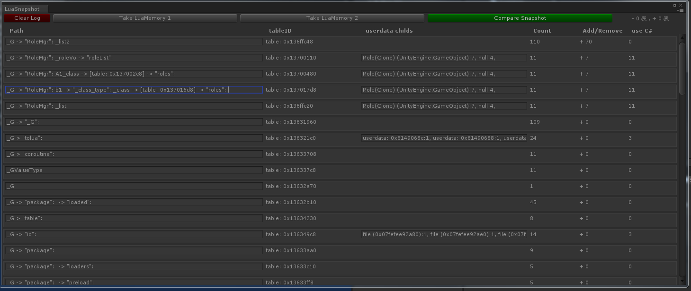

LuaMemory 是什么？
==================
使用Lua开发U3D项目时，经常会遇到lua持有c#的空对象，导致内存泄露的问题。在c#这边分析内存泄露问题有MemeryProfiler，而lua的内存泄露却很难分析。自己在这方面吃过亏，所以专门针对这一问题开发了此工具。

##功能:
==================

* 如图，取样两次即可分析这段期间内增加的Lua内存，如果有lua引用c#空对象的情况也一目了然。最关键是：LuaSnapshot.cs与LuaLogTool.lua这两个文件。
* 原理是通过分析Lua的全局表(_G)，并分析全局表下函数对私有变量的引用，通过debug.getupvalue函数可获取，最后得到表的引用路径，如图：
* 通过引用路径的关键字，即可大致分析到是哪个表容器持有了理应释放的对象。
